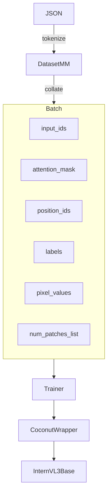

# Migrating *COCONUT* to InternVL 3-1B-Pretrained

> **Scope** – turn the current single-modal (text-only) repo into a training pipeline that can fine-tune the open-source MLLM [OpenGVLab/InternVL3-1B-Pretrained](https://huggingface.co/OpenGVLab/InternVL3-1B-Pretrained) with the continuous-latent-scratch-pad (COCONUT) algorithm.

---

## 1  Dependencies & Environments

| Area | Action |
|------|--------|
| Transformers | Upgrade to `transformers >= 4.39` (first release that ships `AutoModelForImageTextToText` & InternVL HF wrapper). |
| Vision tools | Add `torchvision`, `decord` (for possible video), `Pillow`, `timm` (ViT helpers). |
| Data | Store images under `data/images/{split}/…` and reference them in JSON via `"image" : "<fname>.jpg"`. |
| Mixed precision | ensure CUDA ≥ 11.8, PyTorch ≥ 2.2 for bfloat16/Flash-Attn support. |

Add them to `requirements.txt`.

---

## 2  Directory additions

```
multimodal/
 ├─ transforms.py          # common image ↔ tensor helpers
 ├─ collator_mm.py         # new DataCollatorWithImages
 └─ dataset_mm.py          # image-aware HF-Dataset wrappers
``` 

---

## 3  Code-level modifications

### 3.1  run.py  ➜  trainer entry-point

| Line(s) | Change |
|---------|--------|
| `from transformers import AutoModelForCausalLM` | replace with `AutoModelForImageTextToText` (fall back to `AutoModel` + `trust_remote_code=True`). |
| model load | `model = AutoModelForImageTextToText.from_pretrained(cfg.model_id, trust_remote_code=True)` |
| tokenizer  | still `AutoTokenizer` **plus** add special tokens: `<image>`, `</image>` if not present. |
| processor  | `processor = AutoProcessor.from_pretrained(cfg.model_id, trust_remote_code=True)` – gives vision transforms & prompt template. |
| dataloader | switch to `dataset_mm.get_*` helpers and `collator_mm.MyCollatorMM` (passes `pixel_values`, `num_patches_list`). |
| forward    | training call becomes `outputs = model(**batch)`; COCONUT wrapper still wraps `base_causallm` (see §3.3). |
| evaluation | use `model.chat(tokenizer, pixel_values, prompt, …)` in eval loop instead of plain `generate`. |

### 3.2  dataset.py ➜ dataset_mm.py

1. Parse each JSON record:
   ```jsonc
   { "question": "…", "steps": [ … ], "answer": "…", "image": "img_001.jpg" }
   ```
2.  `tokenize_sample()` – keep text tokenisation unchanged.
3.  Load raw image with `PIL.Image`, apply resize/normalise identical to InternVL card (448×448 dynamic tiling). Return
   ```python
   { 'pixel_values': tensor[N,3,448,448],
     'num_patches': N,
     '… text fields …' }
   ```
4.  Distributed pre-processing can still use `num_proc`.

### 3.3  coconut.py

InternVL wrappers expose `get_input_embeddings()` exactly like GPT-2/Llama so **only two tweaks are required**:

* **Vision tokens are not part of `inputs_embeds`.** They are fused inside the model via an internal projector when `pixel_values` is supplied. Therefore:
  * Accept `**kwargs` and forward `pixel_values`, `num_patches_list` unmodified to `self.base_causallm` in every call.
* The latent-feedback algorithm remains intact; hidden-state indices stay correct because vision tokens appear *before* or *replacing* `<image>` placeholders in `input_ids`.

_No further architectural change is necessary._

### 3.4  utils / Config

* Add new yaml keys: `image_dir`, `max_tiles`, `image_size`.
* When `configs.multimodal == True` automatically set `model_id = "OpenGVLab/InternVL3-1B-Pretrained"` unless overridden.

---

## 4  Data-flow overview



*Pixel tokens are propagated in parallel to text; latent feedback loop touches **only** the text embedding matrix.*

---

## 5  Training recipe example

```yaml
name: coconut_vl3_1b
model_id: OpenGVLab/InternVL3-1B-Pretrained
multimodal: True
image_dir: data/images
train_path: data/gsm8k_mm_train.json
val_path:   data/gsm8k_mm_val.json
max_tiles: 12
image_size: 448
fp16: False
bf16: True
world_size: 4
...
```

---

## 6  Potential pitfalls & mitigations

| Issue | Mitigation |
|-------|------------|
| CUDA OOM (1 B model + vision) | Use gradient-checkpointing and `--fsdp` shards = 2; smallest ViT tiles. |
| Vision prompt ordering | Always place `<image>` at **beginning** of question block so latent-position calculation remains constant across the batch. |
| Collision with special tokens | Verify HF tokenizer does **not** already own `〈|latent|〉`, otherwise call `add_special_tokens`. |

---

## 7  Next steps / nice-to-have

1. Mixed-precision vision tiles (bf16) – already safe in InternVL code.
2. Support video inputs by exposing `pixel_values` concatenated across frames and adding `num_patches_list`.
3. Deploy via `lmdeploy` after fine-tuning (chat template `internvl2_5`).

---

*Last updated:* 2025-07-26 